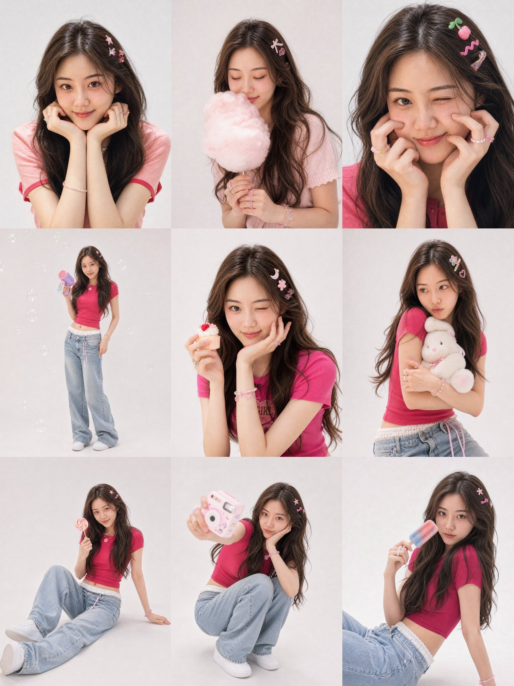

鬼马少女写真提示词

分享一套超梦幻Y2K鬼马少女写真提示词

【GPT Image 2 提示词分享】👇
这是直接生成3*3九宫格的提示词
如果要一张张生图，看我下一条帖子
请基于用户上传的 1-3 张清晰个人照片，生成一张 3×3 九宫格拼贴写真，主题为 「鬼马少女写真」。
一、人物要求
请严格保留用户本人真实身份特征，包括但不限于：
- 脸型
- 五官比例
- 眉眼结构
- 鼻子形状
- 嘴唇形状
- 肤色
- 年龄感
- 发际线
- 发型基础
- 整体气质
最终九张小图里的人物必须清楚看起来是 同一个真实女生，不能变成陌生人，不能欧美化，不能网红化，不能过度美颜，不能出现 AI 假脸。
请只把上传照片作为 人物身份参考，不要保留原照片里的背景、衣服、桌子、杯子、坐姿、拍摄环境和原始构图。请重新生成一整组全新的棚拍写真。
--------------------------------------------------------------------------------
二、整体风格
整组图的风格是：
- 韩系少女杂志感
- 鬼马感
- 甜酷混合
- 俏皮灵动
- 有轻微夸张表情
- 精致棚拍感
- 少女感和时尚感并存
背景统一为 浅灰白、奶白色或极简无缝棚拍背景。
光线柔和明亮，画面干净通透，带一点轻微胶片颗粒感和 editorial 时尚质感。
整体不是普通自拍，也不是廉价影楼风，而是像一组完整企划过的少女写真。
--------------------------------------------------------------------------------
三、发型控制规则
发型请基于用户上传照片进行自然延展和写真化优化，不要脱离本人原始发型特征。重点根据以下三个变量控制：
1. 头发长度决定发型方向
- 短发用户保持短发体系
- 中长发用户保持中长发体系
- 长发用户保持长发体系
不要大幅改变长短。可以在原有长度基础上做轻微层次、发尾弧度、自然卷度和蓬松感优化。
2. 是否有刘海遵循原图
- 如果用户原图有刘海，请保留刘海属性，可优化为轻薄空气刘海、自然碎刘海或更上镜的轻盈刘海
- 如果用户原图没有刘海，请保持无刘海或只保留少量脸侧碎发，不要强行加厚刘海
3. 发色参考原图并做写真化处理
- 如果用户原图发色偏黑，请不要生成死黑、纯黑头发
- 请处理成更自然的 深棕黑、黑茶色或柔和深咖色
- 如果原图本身是棕色或染发，请在原有发色基础上轻微优化层次感和光泽感
整组九张图中的发型主体必须保持一致，只允许出现轻微变化，例如发丝走向、蓬松度、发尾弧度、耳后别发、发夹位置变化。
--------------------------------------------------------------------------------
四、妆容要求
妆容统一为 韩系鬼马少女妆：
- 清透奶油肌底妆，皮肤细腻通透，保留自然真实质感
- 自然柔和平眉
- 眼妆以浅粉棕、蜜桃粉色系为主，轻度晕染
- 下眼睑带一点淡粉感
- 卧蚕自然明显
- 睫毛纤长清晰
- 眼线细而自然
- 腮红是重点，使用大面积粉色或蜜桃粉腮红，从脸颊轻轻延伸到眼下，并带一点鼻尖红晕
- 嘴唇为水润感草莓粉、蜜桃粉或柔和玫瑰粉
整体妆感要甜、灵、俏皮、元气，不要欧美妆，不要浓艳成熟妆，不要厚重女团妆。
--------------------------------------------------------------------------------
五、服装、头饰、配饰、道具
请保留整组统一的鬼马少女方向，但对服装、头饰、道具进行二创设计，不要照搬参考图。
服装方向
- 高饱和少女感短袖上衣
- 颜色可使用：草莓红、蜜桃粉、珊瑚粉、莓果红、亮玫粉、樱桃红
- 下装可为低腰宽松牛仔裤、阔腿牛仔裤、轻松休闲少女风单品
- 整体是甜酷混合、轻时尚、上镜
头饰方向
- 不对称趣味发夹组合
- 可用：透明果冻感发夹、小花发夹、星星发夹、爱心发夹、亚克力异形发夹、彩色小夹子
- 每张可变化，但不要太杂乱
配饰方向
- 彩色串珠戒指
- 彩色细手链
- 糖果感小饰品
道具方向
可从以下中选择并分配到不同小图中：
- 棉花糖
- 彩色冰淇淋
- 迷你纸杯蛋糕
- 小奶昔杯
- 玩具相机
- 泡泡机
- 毛绒玩偶
- 棒棒糖
- 透明趣味小包
- 果冻饮料
- 汽水瓶
--------------------------------------------------------------------------------
六、九宫格内容安排
请生成一张 3×3 九宫格拼贴图，每一格都是不同动作、不同镜头、不同表情，但必须保持同一个女生、同一套风格体系。九张小图不要重复构图，不要重复表情，不要像简单复制变体。
第 1 格：托腮甜笑近景
近景半身特写，女生面对镜头微微甜笑，双手自然托在下巴两侧，眼神直视镜头，表情灵动俏皮，带一点“装乖”的鬼马感。
第 2 格：闭眼闻棉花糖
半身写真，女生闭着眼睛轻轻闻一团粉白色棉花糖，动作自然，表情像在偷偷享受甜味，温柔又可爱。
第 3 格：挤脸搞怪超近景
超近景脸部特写，女生用双手轻轻挤压脸颊和鼻子周围，一只眼睛微微眯起，表情古灵精怪，俏皮又有趣。
第 4 格：全身站姿 + 泡泡机
全身站姿，女生站在无缝棚拍背景前，一手拿彩色泡泡机，另一只手自然垂放或轻轻叉腰，身体微侧，表情轻松俏皮。
第 5 格：抱玩偶发呆
半身到 3/4 身，女生双手抱着毛绒玩偶，眼神看向镜头外侧，微微撅嘴，表情像在发呆，带一点安静又古怪的可爱感。
第 6 格：wink + 手托脸
中近景，女生一只眼睛 wink，另一只眼睛看向镜头，一只手托住脸侧，另一只手拿小甜品道具，表情调皮又得意。
第 7 格：坐地伸腿全身图
全身坐姿，女生坐在地面上，一条腿自然伸开，一条腿微屈，一只手撑地，另一只手拿趣味道具，表情有一点傲娇和坏笑。
第 8 格：蹲坐抱膝 + 道具挡脸
全身或 3/4 身蹲坐，双膝并起，一只手托脸，另一只手把可爱道具举到镜头前，略微挡住脸一小部分，眼神从道具旁边看向镜头。
第 9 格：偏冷脸的甜酷少女
半身到 3/4 身，女生拿着颜色鲜艳的甜品或饮料道具，身体微微侧向镜头，眼神带一点冷冷的观察感，嘴巴轻轻抿起，形成“脸很酷、配饰很甜、整体很鬼马”的反差感。
--------------------------------------------------------------------------------
七、输出要求
- 输出为 一张完整的 3×3 九宫格拼贴图
- 九张小图构图丰富，有近景、半身、全身、坐姿、站姿、蹲姿、特写混合
- 九张图要像同一次写真拍摄的精选成片
- 整体统一但不重复
- 每一格都要精致、清晰、可用
- 不要出现文字、水印、Logo、界面元素